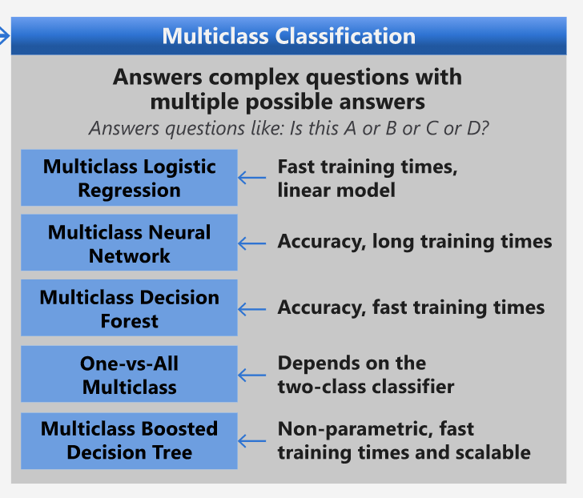

# 菜品分类器 1

本节课程将使用你在上一个课程中所保存的全部经过均衡和清洗的菜品数据。

你将使用此数据集和各种分类器，_根据一组配料预测这是哪一国家的美食_。在此过程中，你将学到更多用来权衡分类任务算法的方法  

## [课前测验](https://gray-sand-07a10f403.1.azurestaticapps.net/quiz/21/)

# 准备工作

假如你已经完成了[课程 1](../../1-Introduction/translations/README.zh-cn.md), 确保在根目录的 `/data` 文件夹中有 _cleaned_cuisines.csv_ 这份文件来进行接下来的四节课程。

## 练习 - 预测某国的菜品

1. 在本节课的 _notebook.ipynb_ 文件中，导入 Pandas，并读取相应的数据文件：

    ```python
    import pandas as pd
    cuisines_df = pd.read_csv("../../data/cleaned_cuisines.csv")
    cuisines_df.head()
    ```

    数据如下所示:

    |     | Unnamed: 0 | cuisine | almond | angelica | anise | anise_seed | apple | apple_brandy | apricot | armagnac | ... | whiskey | white_bread | white_wine | whole_grain_wheat_flour | wine | wood | yam | yeast | yogurt | zucchini |
    | --- | ---------- | ------- | ------ | -------- | ----- | ---------- | ----- | ------------ | ------- | -------- | --- | ------- | ----------- | ---------- | ----------------------- | ---- | ---- | --- | ----- | ------ | -------- |
    | 0   | 0          | indian  | 0      | 0        | 0     | 0          | 0     | 0            | 0       | 0        | ... | 0       | 0           | 0          | 0                       | 0    | 0    | 0   | 0     | 0      | 0        |
    | 1   | 1          | indian  | 1      | 0        | 0     | 0          | 0     | 0            | 0       | 0        | ... | 0       | 0           | 0          | 0                       | 0    | 0    | 0   | 0     | 0      | 0        |
    | 2   | 2          | indian  | 0      | 0        | 0     | 0          | 0     | 0            | 0       | 0        | ... | 0       | 0           | 0          | 0                       | 0    | 0    | 0   | 0     | 0      | 0        |
    | 3   | 3          | indian  | 0      | 0        | 0     | 0          | 0     | 0            | 0       | 0        | ... | 0       | 0           | 0          | 0                       | 0    | 0    | 0   | 0     | 0      | 0        |
    | 4   | 4          | indian  | 0      | 0        | 0     | 0          | 0     | 0            | 0       | 0        | ... | 0       | 0           | 0          | 0                       | 0    | 0    | 0   | 0     | 1      | 0        |

1. 现在，再多导入一些库：

    ```python
    from sklearn.linear_model import LogisticRegression
    from sklearn.model_selection import train_test_split, cross_val_score
    from sklearn.metrics import accuracy_score,precision_score,confusion_matrix,classification_report, precision_recall_curve
    from sklearn.svm import SVC
    import numpy as np
    ```

1. 接下来需要将数据分为训练模型所需的 X（译者注：代表特征数据）和 y（译者注：代表标签数据）两个 dataframe。首先可将 `cuisine` 列的数据单独保存为的一个 dataframe 作为标签（label）。

    ```python
    cuisines_label_df = cuisines_df['cuisine']
    cuisines_label_df.head()
    ```

    输出如下:

    ```output
    0    indian
    1    indian
    2    indian
    3    indian
    4    indian
    Name: cuisine, dtype: object
    ```

1. 调用 `drop()` 方法将 `Unnamed: 0` 和 `cuisine` 列删除，并将余下的数据作为可以用于训练的特证（feature）数据:

    ```python
    cuisines_feature_df = cuisines_df.drop(['Unnamed: 0', 'cuisine'], axis=1)
    cuisines_feature_df.head()
    ```

    你的特征集看上去将会是这样:

    |      | almond | angelica | anise | anise_seed | apple | apple_brandy | apricot | armagnac | artemisia | artichoke |  ... | whiskey | white_bread | white_wine | whole_grain_wheat_flour | wine | wood |  yam | yeast | yogurt | zucchini |
    | ---: | -----: | -------: | ----: | ---------: | ----: | -----------: | ------: | -------: | --------: | --------: | ---: | ------: | ----------: | ---------: | ----------------------: | ---: | ---: | ---: | ----: | -----: | -------- |
    |    0 |      0 |        0 |     0 |          0 |     0 |            0 |       0 |        0 |         0 |         0 |  ... |       0 |           0 |          0 |                       0 |    0 |    0 |    0 |     0 |      0 | 0        |
    |    1 |      1 |        0 |     0 |          0 |     0 |            0 |       0 |        0 |         0 |         0 |  ... |       0 |           0 |          0 |                       0 |    0 |    0 |    0 |     0 |      0 | 0        |
    |    2 |      0 |        0 |     0 |          0 |     0 |            0 |       0 |        0 |         0 |         0 |  ... |       0 |           0 |          0 |                       0 |    0 |    0 |    0 |     0 |      0 | 0        |
    |    3 |      0 |        0 |     0 |          0 |     0 |            0 |       0 |        0 |         0 |         0 |  ... |       0 |           0 |          0 |                       0 |    0 |    0 |    0 |     0 |      0 | 0        |
    |    4 |      0 |        0 |     0 |          0 |     0 |            0 |       0 |        0 |         0 |         0 |  ... |       0 |           0 |          0 |                       0 |    0 |    0 |    0 |     0 |      1 | 0        |

现在，你已经准备好可以开始训练你的模型了！

## 选择你的分类器

你的数据已经清洗干净并已经准备好可以进行训练了，现在需要决定你想要使用的算法来完成这项任务。

Scikit_learn 将分类任务归在了监督学习类别中，在这个类别中你可以找到很多可以用来分类的方法。乍一看上去，有点[琳琅满目](https://scikit-learn.org/stable/supervised_learning.html)。以下这些算法都可以用于分类：

- 线性模型（Linear Models）
- 支持向量机（Support Vector Machines）
- 随机梯度下降（Stochastic Gradient Descent）
- 最近邻（Nearest Neighbors）
- 高斯过程（Gaussian Processes）
- 决策树（Decision Trees）
- 集成方法（投票分类器）（Ensemble methods（voting classifier）） 
- 多类别多输出算法（多类别多标签分类，多类别多输出分类）（Multiclass and multioutput algorithms (multiclass and multilabel classification, multiclass-multioutput classification)）

> 你也可以使用[神经网络来分类数据](https://scikit-learn.org/stable/modules/neural_networks_supervised.html#classification), 但这对于本课程来说有点超纲了。

### 如何选择分类器?

那么，你应该如何从中选择分类器呢？一般来说，可以选择多个分类器并对比他们的运行结果。Scikit-learn 提供了各种算法（包括 KNeighbors、 SVC two ways、 GaussianProcessClassifier、 DecisionTreeClassifier、 RandomForestClassifier、 MLPClassifier、 AdaBoostClassifier、 GaussianNB 以及 QuadraticDiscrinationAnalysis）的[对比](https://scikit-learn.org/stable/auto_examples/classification/plot_classifier_comparison.html)，并且将结果进行了可视化的展示：


> 图表来源于 Scikit-learn 的官方文档

> AutoML 通过在云端运行这些算法并进行了对比，非常巧妙地解决的算法选择的问题，能帮助你根据数据集的特点来选择最佳的算法。试试点击[这里](https://docs.microsoft.com/learn/modules/automate-model-selection-with-azure-automl/?WT.mc_id=academic-15963-cxa)了解更多。

### 另外一种效果更佳的分类器选择方法

比起无脑地猜测，你可以下载这份[机器学习速查表（cheatsheet）](https://docs.microsoft.com/azure/machine-learning/algorithm-cheat-sheet?WT.mc_id=academic-15963-cxa)。这里面将各算法进行了比较，能更有效地帮助我们选择算法。根据这份速查表，我们可以找到要完成本课程中涉及的多类型的分类任务，可以有以下这些选择：


> 微软算法小抄中部分关于多类型分类任务可选算法

✅ 下载这份小抄，并打印出来，挂在你的墙上吧！

### 选择的流程

让我们根据所有限制条件依次对各种算法的可行性进行判断：

- **神经网络（Neural Network）太过复杂了**。我们的数据很清晰但数据量比较小，此外我们是通过 notebook 在本地进行训练的，神经网络对于这个任务来说过于复杂了。
- **二分类法（two-class classifier）是不可行的**。我们不能使用二分类法,所以这就排除了一对多（one-vs-all）算法。 
- **可以选择决策树以及逻辑回归算法**。决策树应该是可行的，此外也可以使用逻辑回归来处理多类型数据。
- **多类型增强决策树是用于解决其他问题的**. 多类型增强决策树最适合的是非参数化的任务，即任务目标是建立一个排序，这对我们当前的任务并没有作用。

### 使用 Scikit-learn 

我们将会使用 Scikit-learn 来对我们的数据进行分析。然而在 Scikit-learn 中使用逻辑回归也有很多方法。可以先了解一下逻辑回归算法需要[传递的参数](https://scikit-learn.org/stable/modules/generated/sklearn.linear_model.LogisticRegression.html?highlight=logistic%20regressio#sklearn.linear_model.LogisticRegression)。

当我们需要 Scikit-learn 进行逻辑回归运算时，`multi_class` 以及 `solver`是最重要的两个参数，因此我们需要特别说明一下。 `multi_class` 是分类方式选择参数，而`solver`优化算法选择参数。值得注意的是，并不是所有的 solvers 都可以与`multi_class`参数进行匹配的。

根据官方文档，在多类型分类问题中:

- 当 `multi_class` 被设置为 `ovr` 时，将使用 **“一对其余”(OvR)策略（scheme）**。
- 当 `multi_class` 被设置为 `multinomial` 时，则使用的是**交叉熵损失（cross entropy loss）** 作为损失函数。(注意，目前`multinomial`只支持‘lbfgs’, ‘sag’, ‘saga’以及‘newton-cg’等 solver 作为损失函数的优化方法)

> 🎓 在本课程的任务中“scheme”可以是“ovr(one-vs-rest)”也可以是“multinomial”。因为逻辑回归本来是设计来用于进行二分类任务的，这两个 scheme 参数的选择都可以使得逻辑回归很好的完成多类型分类任务。[来源](https://machinelearningmastery.com/one-vs-rest-and-one-vs-one-for-multi-class-classification/)

> 🎓 “solver”被定义为是"用于解决优化问题的算法"。[来源](https://scikit-learn.org/stable/modules/generated/sklearn.linear_model.LogisticRegression.html?highlight=logistic%20regressio#sklearn.linear_model.LogisticRegression).

Scikit-learn提供了以下这个表格来解释各种solver是如何应对的不同的数据结构所带来的不同的挑战的:


## 练习 - 分割数据

因为你刚刚在上一节课中学习了逻辑回归，我们这里就通过逻辑回归算法，来演练一下如何进行你的第一个机器学习模型的训练。首先，需要通过调用`train_test_split()`方法可以把你的数据分割成训练集和测试集：

```python
X_train, X_test, y_train, y_test = train_test_split(cuisines_feature_df, cuisines_label_df, test_size=0.3)
```

## 练习 - 调用逻辑回归算法

接下来，你需要决定选用什么 _scheme_ 以及 _solver_ 来进行我们这个多类型分类的案例。在这里我们使用 LogisticRegression 方法，并设置相应的 multi_class 参数，同时将 solver 设置为 **liblinear** 来进行模型训练。

1. 创建一个逻辑回归模型，并将 multi_class 设置为 `ovr`，同时将 solver 设置为 `liblinear`:

    ```python
    lr = LogisticRegression(multi_class='ovr',solver='liblinear')
    model = lr.fit(X_train, np.ravel(y_train))
    
    accuracy = model.score(X_test, y_test)
    print ("Accuracy is {}".format(accuracy))
    ```

    ✅ 也可以试试其他 solver 比如 `lbfgs`, 这也是默认参数

    > 注意, 使用 Pandas 的 [`ravel`](https://pandas.pydata.org/pandas-docs/stable/reference/api/pandas.Series.ravel.html) 方法可以在需要的时候将你的数据进行降维

    运算之后，可以看到准确率高达 **80%**!

1. 你也可以通过查看某一行数据（比如第 50 行）来观测到模型运行的情况:

    ```python
    print(f'ingredients: {X_test.iloc[50][X_test.iloc[50]!=0].keys()}')
    print(f'cuisine: {y_test.iloc[50]}')
    ```

    运行后的输出如下:

   ```output
   ingredients: Index(['cilantro', 'onion', 'pea', 'potato', 'tomato', 'vegetable_oil'], dtype='object')
   cuisine: indian
   ```

   ✅ 试试不同的行索引来检查一下计算的结果吧

1. 我们可以再进行一部深入的研究，检查一下本轮预测结果的准确率:

    ```python
    test= X_test.iloc[50].values.reshape(-1, 1).T
    proba = model.predict_proba(test)
    classes = model.classes_
    resultdf = pd.DataFrame(data=proba, columns=classes)
    
    topPrediction = resultdf.T.sort_values(by=[0], ascending = [False])
    topPrediction.head()
    ```

    运行后的输出如下———可以发现这是一道印度菜的可能性最大，是最合理的猜测:

    |          |        0 |
    | -------: | -------: |
    |   indian | 0.715851 |
    |  chinese | 0.229475 |
    | japanese | 0.029763 |
    |   korean | 0.017277 |
    |     thai | 0.007634 |

    ✅ 你能解释下为什么模型会如此确定这是一道印度菜么？

1. 和你在之前的回归的课程中所做的一样，我们也可以通过输出分类的报告得到关于模型的更多的细节：

    ```python
    y_pred = model.predict(X_test)
    print(classification_report(y_test,y_pred))
    ```

    | precision    | recall | f1-score | support |      |
    | ------------ | ------ | -------- | ------- | ---- |
    | chinese      | 0.73   | 0.71     | 0.72    | 229  |
    | indian       | 0.91   | 0.93     | 0.92    | 254  |
    | japanese     | 0.70   | 0.75     | 0.72    | 220  |
    | korean       | 0.86   | 0.76     | 0.81    | 242  |
    | thai         | 0.79   | 0.85     | 0.82    | 254  |
    | accuracy     | 0.80   | 1199     |         |      |
    | macro avg    | 0.80   | 0.80     | 0.80    | 1199 |
    | weighted avg | 0.80   | 0.80     | 0.80    | 1199 |

## 挑战

在本课程中，你使用了清洗后的数据建立了一个机器学习的模型，这个模型能够根据输入的一系列的配料来预测菜品来自于哪个国家。请再花点时间阅读一下 Scikit-learn 所提供的关于可以用来分类数据的其他方法的资料。此外，你也可以深入研究一下“solver”的概念并尝试一下理解其背后的原理。

## [课后测验](https://gray-sand-07a10f403.1.azurestaticapps.net/quiz/22/)

## 回顾与自学

[这个课程](https://people.eecs.berkeley.edu/~russell/classes/cs194/f11/lectures/CS194%20Fall%202011%20Lecture%2006.pdf)将对逻辑回归背后的数学原理进行更加深入的讲解

## 作业 

[学习 solver](assignment.md)
